# E2N: An Edge Classificaton Model
**E2N** - Edges to Nodes, a strategy for edge classification. 

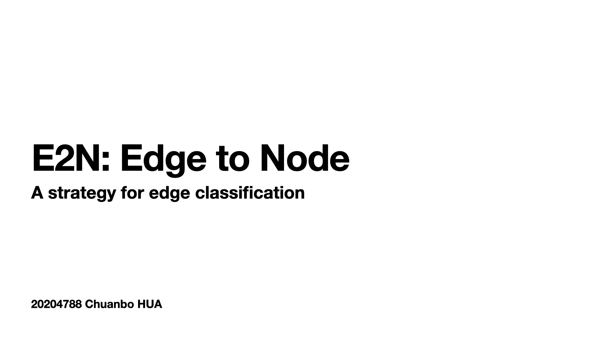

## Background

There are more and more vertex classification models with excellent performances. However, in the meanwhile, little effort has been taken on the problem of edge classification. The problem of edge classification is generally harder than that of vertex classification. This is because vertex classification methods are primarily based on the notion of homophily, while it is generally much more diffcult to apply such homophily principle to edges. 

Some methods based on behavior relation interplay (BIR) has been used in social network link prediction, such as friends network and trust network. There methods are mostly unsupervised and rely on features on exact domain in graph, also used domain features to infer edge types with supervised models. These domain-feature-baed methods require particular networks and network relationships, so can not handle more general networks' edge classification problems. 

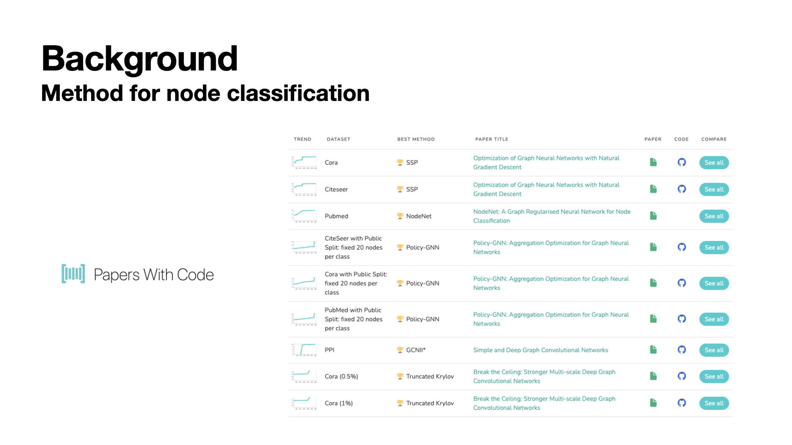

Since there are many excellent models for nodes classification which can handle more general problems, we considered the method about transferring edges to nodes in graph, and then apply such node classification methods on transfered graph to make edge classification. 

Gao et al. proposed an expectation maximization approach on edge-type trainsition matrix, which works as transferring edges in graph to nodes based on adjancy matrix of the graph. They applied this method on biomedical problems, about gene co-expression, biochemical regulation, and biomolecular inhibition or activation. 

However, the methods here emphasis more on ragion features, not for exact edge classification, which not match what we need for TCP attack connection detecting. Inspire by this, we tried to create a new edge to node strategy, E2N, to handle this problem. 

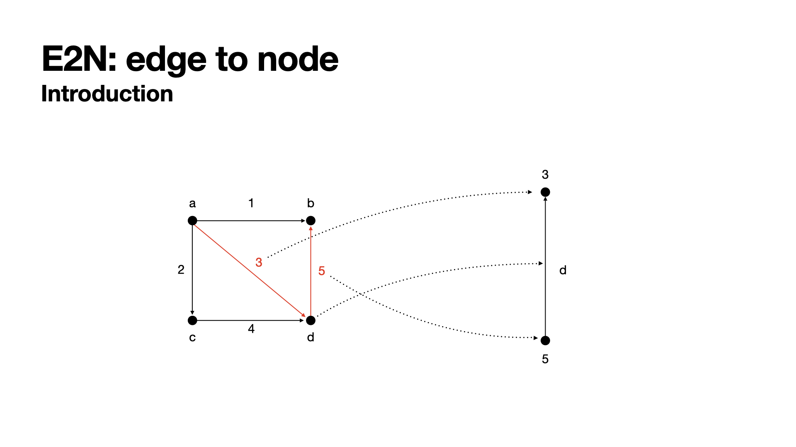

## Algorithm

We create two strategies to convert edges to nodes. To do so, we firstly directly set edges in original graph `e_{ori}^i`to transformed nodes `v_{trans}^i`with several features, which will be shown later. Then connect transformed nodes `v_{trans}^i` by two methods. Firstly, we create directed edges ​`e_{trans}^{(i, j)}​` from transformed node `v_{trans}^i​` to transformed node `v_{trans}^j​`, if the destination node of the original edge for `v_{trans}^i​`  is the same with the source noe of the original edge for `v_{trans}^j​`. Secondly, for those edges in orignal graph with the same source node, we make them fully connected in transformed graph.  By this way we get a converted graph where nodes in it are edges in original graph. Then we will assign features to this new graph. 

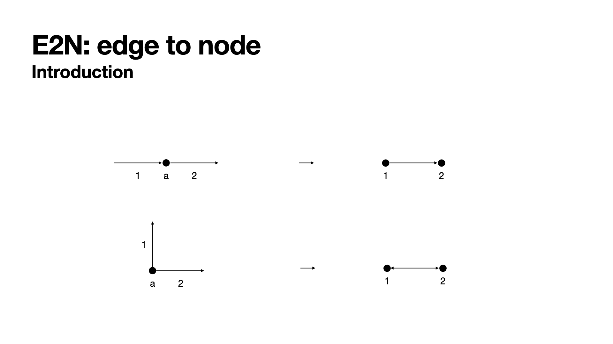

For example, we can transfer the left graph to the right part by this method. 

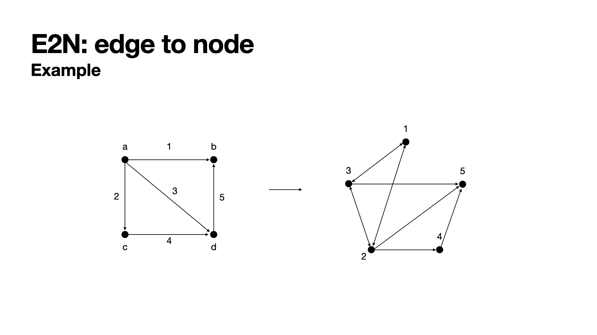

During this process, we can see that edge `3` and edge `5` are transferred to edge `3->5` in new graph based on the first transfer rule. 

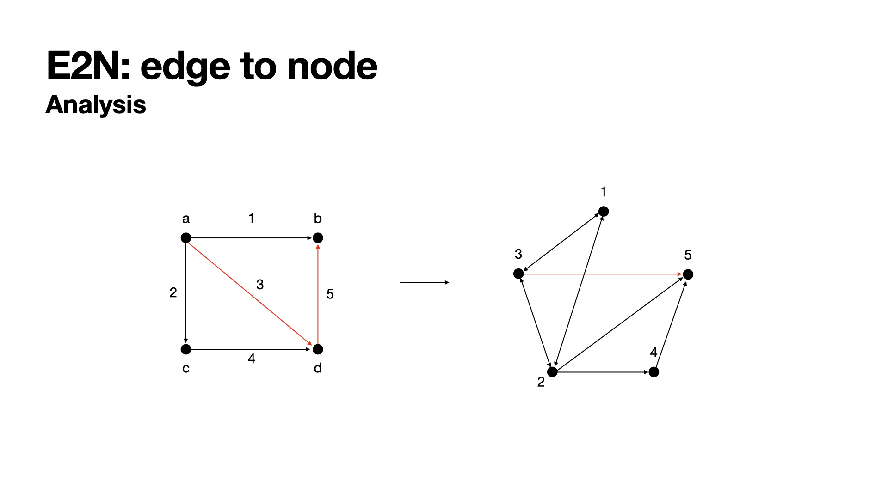

And all out edges for node `a`, i.e. edge `1, 2, 3` will become fully connected in the transferred graph, i.e. nodes `1, 2, 3` based on the second transfer rule. 

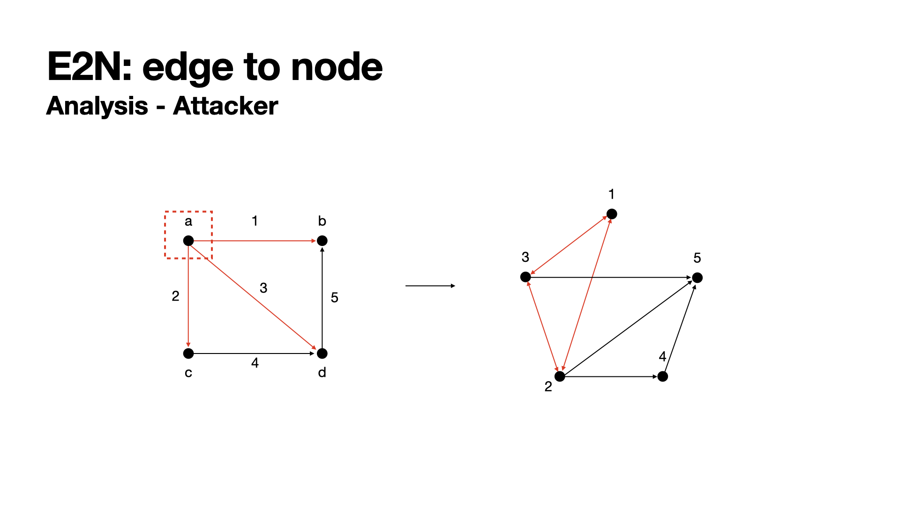

We completed the creation of transformed graph so far and going to apply some node classification methods on this graph. We applied multi layers graph convolutional network (GCN) to process the graph. In which model, graph convolutional layers are responsible for exacting high-level node representations, graph pooling layers play the role of downsampling. Based on the strategy of transforming graph, we know that for those edges from one node will be transformed to a community, and using GCN can easily detect them in graph, which match our conceptions about nodes type in graph. 

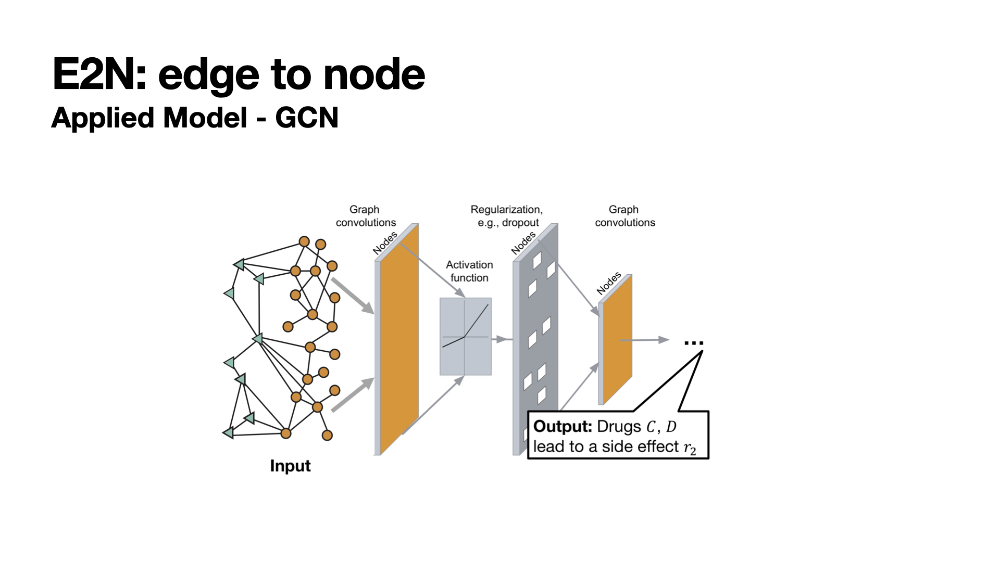

Beside the GCN layers we applied, we also applied graph attention network (GAT) on the graph. The point of using GAT is to emphasis the connection chain within the graph. This model will give more importance on connection routes. 

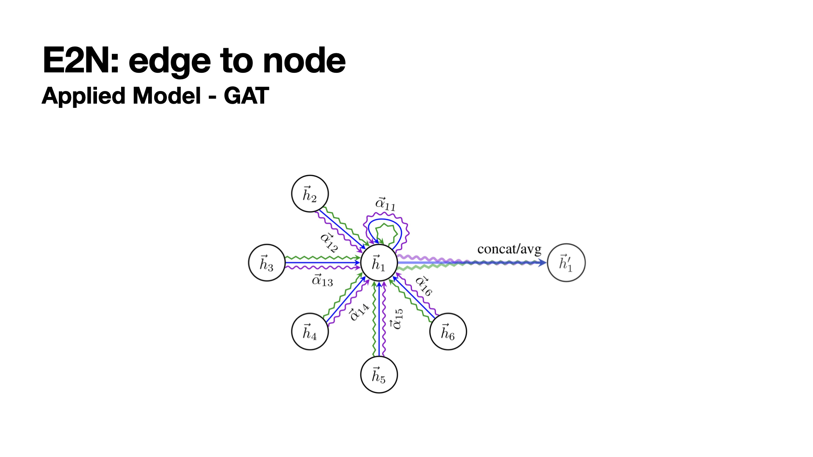

## Experiment

### Dataset

The dataset we used is about TCP connection attack prediction, which contains TCP connection histories. Each TCP connection history consists of the source IP, destination IP, port, timestamp, and the type of connection:

- **Source IP**: IP of the source address.
- **Destination IP**: IP of the destination address. 
- **Port**: Port number of the destination. 
- **Timestamp**: Timestapmp indicating the seconds elapsed from a particular date, which is **unknown**. 
- **Type of connection**: There are 26 types of TCP connections which consist of one benign type and 25 attack types. Note that the benign type is denoted by "-", and each attack type is denoted by its name. (e.g. apache2, abck, dict, etc.)

All datasets consist of TCP connection histories for 30 minutes. Detailed information about hte datasets is given below:

1. **Trainning Dataset** (`train_xxx.txt`)
   
   In the training dataset, all information about the TCP connection is included in each line of the file. More specifically, each line provides the source id, destination id, port, timestamp, and the type of connection, which are separated by a tab as follows:
   
   `<SOURCE IP>\t<DESTINATION IP>\t<PORT>\t<TIMESTAMP>\t<CONNECTION TYPE>`
   
2. **Validation Dataset** (`valid_query_xxx.txt`, `valid_answer_xxx.txt`)

   Validation datasets consist of query and answer files. In query files, each line of the file is in the following format:

   `<SOURCE IP>\t<DESTINATION IP>\t<PORT>\t<TIMESTAMP>`

   In answer files , each file contains the tab-delimited list of attack types that the corresponding validation query dataset has. If the corresponding dataset does not contain any TCP connections corresponding to attacks, then the answer file will be empty.

3. **Test Dataset** (`test_query_xxx.txt`)

   Test datasets only contain query files. Each line of the file is in the following format:

   `<SOURCE IP>\t<DESTINATION IP>\t<PORT>\t<TIMESTAMP>`

### Features

Features we chose for transformed nodes are source node's in-degree, source node's out-degree, destinate node's in-degree, destinate node's out-degree, port used number, averate connection time and connection times. The explaination for those features are as following. 

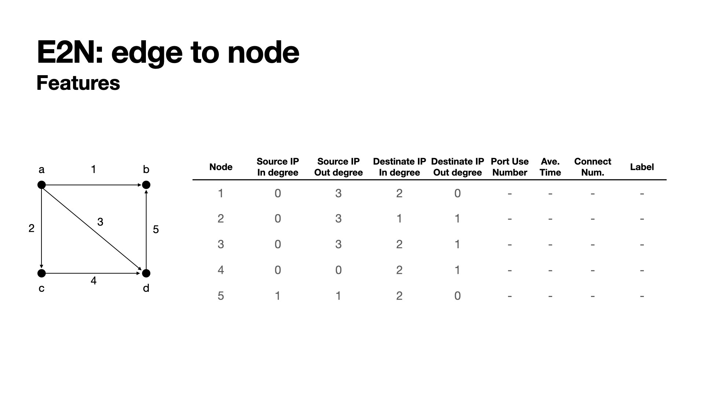

**Source node's in-degree and out-degree**: we have one conception that there are some attackers in the network. Such attackers have the features that they have many out connections while fewer in connections, so if we detect an edge with it's source node having high out-degrees, it is reasonable for us to suspect that this node may be an attacker, and give a higer weight for edges from it to be anormaly connections.

**Destinate node's in-degree and out-degree**: similar with souce node's in-degree and out-degree features, we also hold on conception that there are some servers easily being attacked in the network. For example, in real world, some server with poor firewall system will be easily attacked, at this time, there will be a high level of in-degree for this server node. So, if we detect an edge with it's destination node haveing high in-degree, it would be also reasonable for us to suspect that this node is being attacked and this edge would be an anormaly connection.  

**Port used number**: since for each node, i.e. each edge in original graph, there maybe more than once connected within a time window. Such connection may use different ports to connect, we record the type of ports those connections used as a feature, which would be useful to show the pattern of attack connections. 

**Average connection time**: claculate the average connection times for connections on one edge as a feature. 

**Connection times**: one edge in original graph will be actived several times, we record this number as a feature. 

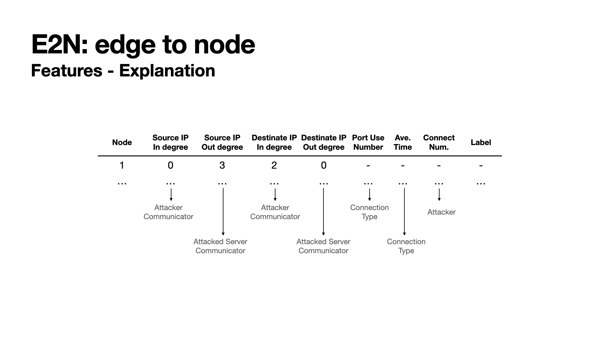

We create our graph transformer functions to generate edge to node graph from original graph. And then applied DGL packages to analysis and train the model. For GCN model, we set the number of hidden layer to 16. During the experiment, we got to know that by this way the model will give much more weight to exact attack types. To deal with this problem, we added another balance weigh matrix to model to control the unbalance of trinning. 

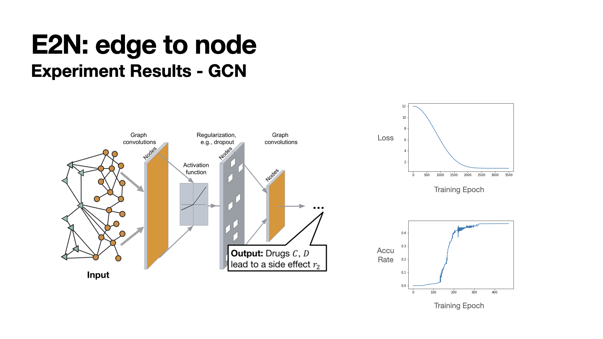

The unbalance of dataset has much influence on the trainning, since in GCN model, it would be easy to ignore some attack connections within many in-connections or out-connections. We also applied average strategy during assigning features, which will also lost some informations about exact attack connections. 

## How to use

### Environment

```python
Python Version: 3.6 or later
Python Packages: DGL, networkX
```

### Steps

1. [Download](https://github.com/cbhua/model-eton/releases/tag/v1.0) or [Clone](https://github.com/cbhua/model-eton.git) this repository.
2. Check `data_loader_single.ipynb` to test the running of dataloader for single dataset file, which contains loading data, transferring graph and create DGL graph for trainning.
3. Check `data_loader_multi.ipynb` to test the running of dataloader for all the train set and model. 
4. Check `model_gcn.ipynb` to run GCN on transferred graph to get train results. 

Or you can check the `package ver` folder to find python scripts and set up them as a package to use. 

## Reference

E. DavidandK. Jon, *Networks, Crowds, and Markets: Reasoning About a Highly Connected World*. Cambridge University Press, 2010.

G. Zheng, F. Gang, O. Chunping, T. Satoshi, X.Z.Liu, J. Yang, C. Gessner, B. Foote, D. Wild, Q. Yu,and Y. Ding. *edge2vec:  Representation learning usingedge semantics for biomedical knowledge discovery*. Proceedings of the 2011 European Conference on Machine Learning and Knowledge Discovery inDatabases (PKDD’11), 2011.

P. Agrawal, V. K. Garg, and R. Narayanam. *Link label prediction in signed social networks*. Proceedings of the Twenty-Third International Joint Conferenceon Artificial Intelligence (IJCAI’13), 2013.

W. Tang, H. Zhuang, and J. Tang. *Learning to infersocial ties in large networks*. Proceedings of the 2011 European Conference on Machine Learning and Knowledge Discovery in Databases (PKDD’11), 2011.

S. H. Yang, A. J. Smola, B. Long, H. Zha, andY. Chang. *Friend or frenemy?:  Predicting signed tiesin social networks*. Proceedings of the 35th International ACM SIGIR Conference on Researchand Development in Information Retrieval (SIGIR’12), 2012.